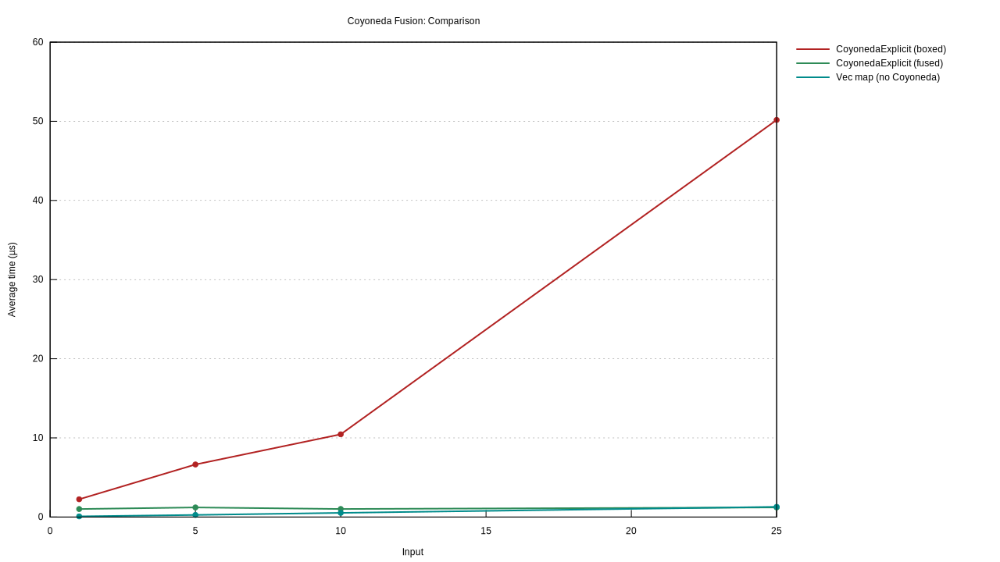
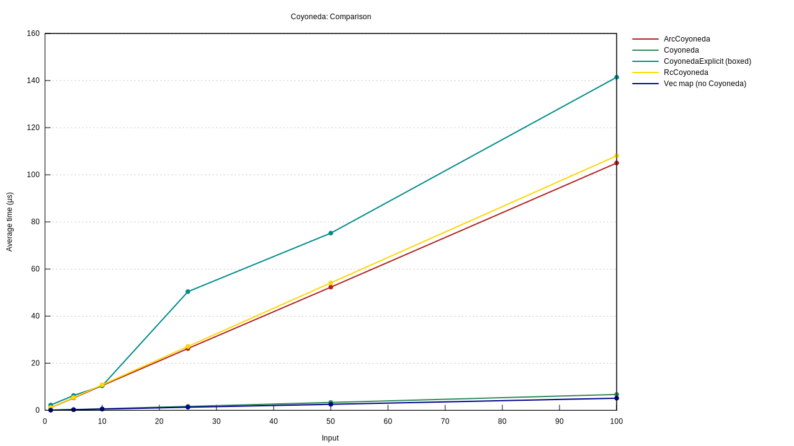
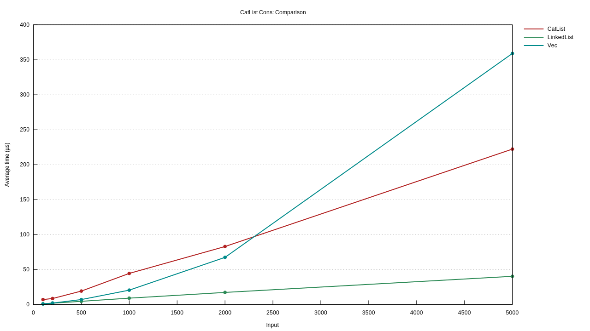
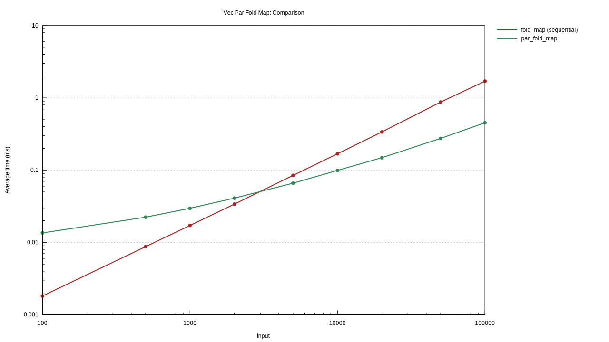
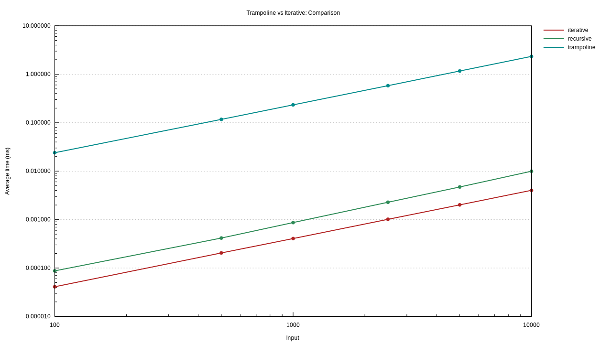

# Benchmarking Comparison

This document outlines benchmarks implemented for the `fp-library` against Rust's standard library.

## Key Results

Results collected on: AMD Ryzen 9 7940HS (16 cores), Linux 6.12.77, rustc 1.93.1, bench profile.

### CoyonedaExplicit Map Fusion

CoyonedaExplicit composes maps at the type level, resulting in a single call to `F::map` at lower time regardless of chain depth. The fused line is flat while Direct scales linearly.

### Coyoneda Variants

Compares all Coyoneda variants across map chain depths (1-100). Direct and Box-Coyoneda are fastest; Rc/Arc variants pay per-map allocation costs.

### CatList Cons

CatList cons vs Vec insert(0) vs LinkedList push_front across sizes. Vec's O(n) insert(0) crosses over CatList at ~2000-2500 elements.

### Parallel vs Sequential Fold Map

Vec par_fold_map vs sequential fold_map across sizes (100-100K) with string monoid. Rayon parallelism crosses over at ~3000-4000 elements. Log scale on both axes.

### Trampoline vs Iterative Loop

Cost of stack safety: Trampoline vs plain recursion vs a hand-written while loop, all doing equivalent work per step. Trampoline is ~230x slower than recursion but never overflows (recursion overflows at ~500K depth). Log scale on Y axis.

## Detailed Comparisons

The following tables list all implemented benchmarks.

### Vec

| Feature | `fp-library`       | `std`                      | Status                                                     | [ ] |
| :------ | :----------------- | :------------------------- | :--------------------------------------------------------- | --- |
|         | **Map**            | `VecBrand::map`            | `iter().map().collect()`                                   | [x] |
|         | **Fold Right**     | `VecBrand::fold_right`     | `iter().rev().fold()`                                      | [x] |
|         | **Fold Left**      | `VecBrand::fold_left`      | `iter().fold()`                                            | [x] |
|         | **Fold Map**       | `VecBrand::fold_map`       | `iter().map().fold()`                                      | [x] |
|         | **Traverse**       | `VecBrand::traverse`       | `iter().map().collect::<Result<Vec<_>, _>>()` (for Result) | [x] |
|         | **Sequence**       | `VecBrand::sequence`       | `iter().collect::<Result<Vec<_>, _>>()` (for Result)       | [x] |
|         | **Bind**           | `VecBrand::bind`           | `iter().flat_map().collect()`                              | [x] |
|         | **Append**         | `Semigroup::append`        | `[a, b].concat()`                                          | [x] |
|         | **Empty**          | `Monoid::empty`            | `Vec::new()`                                               | [x] |
|         | **Construct**      | `VecBrand::construct`      | `[vec![x], y].concat()`                                    | [x] |
|         | **Deconstruct**    | `VecBrand::deconstruct`    | `slice.split_first()`                                      | [x] |
|         | **Filter**         | `VecBrand::filter`         | `iter().filter().collect()`                                | [x] |
|         | **Filter Map**     | `VecBrand::filter_map`     | `iter().filter_map().collect()`                            | [x] |
|         | **Partition**      | `VecBrand::partition`      | `iter().partition()`                                       | [x] |
|         | **Partition Map**  | `VecBrand::partition_map`  | Manual loop with two accumulators                          | [x] |
|         | **Compact**        | `VecBrand::compact`        | `iter().flatten().collect()`                               | [x] |
|         | **Separate**       | `VecBrand::separate`       | Manual loop splitting `Result`s                            | [x] |
|         | **Wither**         | `VecBrand::wither`         | Manual loop with conditional push                          | [x] |
|         | **Wilt**           | `VecBrand::wilt`           | Manual loop with two accumulators                          | [x] |
|         | **Lift2**          | `VecBrand::lift2`          | `flat_map` + `map` combination                             | [x] |
|         | **Pure**           | `VecBrand::pure`           | `vec![x]`                                                  | [x] |
|         | **Apply**          | `VecBrand::apply`          | `flat_map` + `map` combination                             | [x] |
|         | **Par Map**        | `VecBrand::par_map`        | Sequential `map` (100, 1K, 10K, 100K)                      | [x] |
|         | **Par Fold Map**   | `VecBrand::par_fold_map`   | Sequential `fold_map` (100, 1K, 10K, 100K)                 | [x] |
|         | **Par Filter Map** | `VecBrand::par_filter_map` | Sequential `filter_map` (100, 1K, 10K, 100K)               | [x] |
|         | **Par Compact**    | `VecBrand::par_compact`    | Sequential `compact` (100, 1K, 10K, 100K)                  | [x] |

### Option

| Feature | `fp-library`      | `std`                        | Status                                   | [ ] |
| :------ | :---------------- | :--------------------------- | :--------------------------------------- | --- |
|         | **Map**           | `OptionBrand::map`           | `Option::map`                            | [x] |
|         | **Fold Right**    | `OptionBrand::fold_right`    | `map_or`                                 | [x] |
|         | **Fold Left**     | `OptionBrand::fold_left`     | `map_or`                                 | [x] |
|         | **Traverse**      | `OptionBrand::traverse`      | `Option::map().transpose()` (for Result) | [x] |
|         | **Sequence**      | `OptionBrand::sequence`      | `Option::transpose()` (for Result)       | [x] |
|         | **Bind**          | `OptionBrand::bind`          | `Option::and_then`                       | [x] |
|         | **Filter**        | `OptionBrand::filter`        | `Option::filter`                         | [x] |
|         | **Filter Map**    | `OptionBrand::filter_map`    | `Option::and_then`                       | [x] |
|         | **Partition**     | `OptionBrand::partition`     | Conditional split                        | [x] |
|         | **Partition Map** | `OptionBrand::partition_map` | `map_or` with conditional                | [x] |
|         | **Compact**       | `OptionBrand::compact`       | `Option::flatten`                        | [x] |
|         | **Separate**      | `OptionBrand::separate`      | Pattern match on `Option<Result>`        | [x] |
|         | **Wither**        | `OptionBrand::wither`        | `map` + `unwrap_or`                      | [x] |
|         | **Wilt**          | `OptionBrand::wilt`          | `map` + `unwrap_or`                      | [x] |
|         | **Lift2**         | `OptionBrand::lift2`         | `Option::zip` + `map`                    | [x] |
|         | **Pure**          | `OptionBrand::pure`          | `Some(x)`                                | [x] |
|         | **Apply**         | `OptionBrand::apply`         | Pattern match                            | [x] |

### Result

| Feature | `fp-library`   | `std`                               | Status                                   | [ ] |
| :------ | :------------- | :---------------------------------- | :--------------------------------------- | --- |
|         | **Map**        | `ResultErrAppliedBrand::map`        | `Result::map`                            | [x] |
|         | **Fold Right** | `ResultErrAppliedBrand::fold_right` | `map_or`                                 | [x] |
|         | **Fold Left**  | `ResultErrAppliedBrand::fold_left`  | `map_or`                                 | [x] |
|         | **Traverse**   | `ResultErrAppliedBrand::traverse`   | `Result::map().transpose()` (for Option) | [x] |
|         | **Sequence**   | `ResultErrAppliedBrand::sequence`   | `Result::transpose()` (for Option)       | [x] |
|         | **Bind**       | `ResultErrAppliedBrand::bind`       | `Result::and_then`                       | [x] |
|         | **Lift2**      | `ResultErrAppliedBrand::lift2`      | `and_then` + `map`                       | [x] |
|         | **Pure**       | `ResultErrAppliedBrand::pure`       | `Ok(x)`                                  | [x] |
|         | **Apply**      | `ResultErrAppliedBrand::apply`      | Pattern match                            | [x] |

### String

| Feature | `fp-library` | `std`               | Status           | [ ] |
| :------ | :----------- | :------------------ | :--------------- | --- |
|         | **Append**   | `Semigroup::append` | `+` / `push_str` | [x] |
|         | **Empty**    | `Monoid::empty`     | `String::new()`  | [x] |

### Pair

| Feature | `fp-library`   | `std`                               | Status                                   | [ ] |
| :------ | :------------- | :---------------------------------- | :--------------------------------------- | --- |
|         | **Map**        | `PairFirstAppliedBrand::map`        | Manual tuple construction                | [x] |
|         | **Fold Right** | `PairFirstAppliedBrand::fold_right` | Direct field access                      | [x] |
|         | **Fold Left**  | `PairFirstAppliedBrand::fold_left`  | Direct field access                      | [x] |
|         | **Traverse**   | `PairFirstAppliedBrand::traverse`   | `map` + tuple reconstruction             | [x] |
|         | **Sequence**   | `PairFirstAppliedBrand::sequence`   | `map` + tuple reconstruction             | [x] |
|         | **Bind**       | `PairFirstAppliedBrand::bind`       | Manual semigroup append + extraction     | [x] |
|         | **Lift2**      | `PairFirstAppliedBrand::lift2`      | Manual semigroup append + field combine  | [x] |
|         | **Pure**       | `PairFirstAppliedBrand::pure`       | `Pair(Monoid::empty(), x)`               | [x] |
|         | **Apply**      | `PairFirstAppliedBrand::apply`      | Manual semigroup append + function apply | [x] |

### Functions

| Feature | `fp-library` | `std`      | Status                   | [ ] |
| :------ | :----------- | :--------- | :----------------------- | --- |
|         | **Identity** | `identity` | `std::convert::identity` | [x] |

### Lazy Evaluation

| Feature | `fp-library`                | Description                                             | Status                                             | [ ] |
| :------ | :-------------------------- | :------------------------------------------------------ | :------------------------------------------------- | --- |
|         | **Thunk Baseline**          | `Thunk::new` + `evaluate`                               | Baseline overhead                                  | [x] |
|         | **Thunk Map Chain**         | `Thunk::map` chains (1, 5, 10, 25, 50, 100)             | Cost of chained maps                               | [x] |
|         | **Thunk Bind Chain**        | `Thunk::bind` chains (1, 5, 10, 25, 50, 100)            | Cost of chained binds                              | [x] |
|         | **Trampoline Baseline**     | `Trampoline::new` + `evaluate`                          | Baseline overhead                                  | [x] |
|         | **Trampoline Bind Chain**   | `Trampoline::bind` chains (100-10K, 6 sizes)            | Stack-safe bind performance                        | [x] |
|         | **Trampoline Map Chain**    | `Trampoline::map` chains (100-10K, 6 sizes)             | Stack-safe map performance                         | [x] |
|         | **Trampoline tail_rec_m**   | Countdown from 10K via `ControlFlow`                    | Monadic tail recursion                             | [x] |
|         | **Trampoline vs Iterative** | `tail_rec_m` vs hand-written loop                       | Overhead vs imperative code                        | [x] |
|         | **RcLazy First Access**     | `Lazy::<_, RcLazyConfig>::new` + first `evaluate`       | Memoization first-access cost                      | [x] |
|         | **RcLazy Cached Access**    | Repeated `evaluate` on cached value                     | Memoization cache-hit cost                         | [x] |
|         | **RcLazy ref_map Chain**    | `ref_map` chains (1, 5, 10, 25, 50, 100)                | Cost of chained ref-mapped lazy values             | [x] |
|         | **ArcLazy First Access**    | `ArcLazy::new` + first `evaluate`                       | Thread-safe memoization first-access cost          | [x] |
|         | **ArcLazy Cached Access**   | Repeated `evaluate` on cached value                     | Thread-safe memoization cache-hit cost             | [x] |
|         | **ArcLazy ref_map Chain**   | `ref_map` chains (1, 5, 10, 25, 50, 100)                | Cost of chained ref-mapped thread-safe lazy values | [x] |
|         | **Free Left-Assoc Bind**    | Left-associated `Free::bind` chains (100-10K, 6 sizes)  | CatList-backed O(1) bind reassociation             | [x] |
|         | **Free Right-Assoc Bind**   | Right-associated `Free::bind` chains (100-10K, 6 sizes) | Nested right-bind performance                      | [x] |
|         | **Free Evaluate**           | `Free::wrap` + `bind` chains (100-10K, 6 sizes)         | Evaluation of suspended computations               | [x] |

### CatList

| Feature | `fp-library`          | Compared Against             | Description                                       | Status | [ ] |
| :------ | :-------------------- | :--------------------------- | :------------------------------------------------ | :----- | --- |
|         | **Cons**              | CatList vs LinkedList vs Vec | Prepend element (O(1))                            | [x]    |
|         | **Snoc**              | CatList vs Vec               | Append element (O(1))                             | [x]    |
|         | **Append**            | CatList vs Vec               | Concatenation (O(1) vs O(n))                      | [x]    |
|         | **Uncons**            | CatList vs Vec vs LinkedList | Head/Tail decomposition (amortized O(1))          | [x]    |
|         | **Left-Assoc Append** | CatList vs Vec vs LinkedList | Repeated left-associated appends (O(n) vs O(n^2)) | [x]    |
|         | **Iteration**         | CatList vs Vec vs LinkedList | Full iteration overhead                           | [x]    |
|         | **Nested Uncons**     | CatList (nested vs flat)     | Uncons on deeply nested structures                | [x]    |
|         | **Fold Map**          | CatList vs Vec (fp + std)    | fold_map performance                              | [x]    |
|         | **Fold Left**         | CatList vs Vec (fp + std)    | fold_left performance                             | [x]    |
|         | **Traverse**          | CatList vs Vec (fp)          | traverse with Option                              | [x]    |
|         | **Filter**            | CatList vs Vec (fp + std)    | filter performance                                | [x]    |
|         | **Compact**           | CatList vs Vec (fp + std)    | compact performance                               | [x]    |

### Coyoneda

| Feature | `fp-library`           | Compared Against                      | Description                                    | Status | [ ] |
| :------ | :--------------------- | :------------------------------------ | :--------------------------------------------- | :----- | --- |
|         | **Direct vs Variants** | Direct map vs all 4 Coyoneda variants | Map chain cost at depths 1, 5, 10, 25, 50, 100 | [x]    |
|         | **Repeated Lower**     | RcCoyoneda vs ArcCoyoneda             | Re-evaluation cost (3x lower_ref)              | [x]    |
|         | **Clone Map**          | RcCoyoneda vs ArcCoyoneda             | Clone + map + lower_ref pattern                | [x]    |
