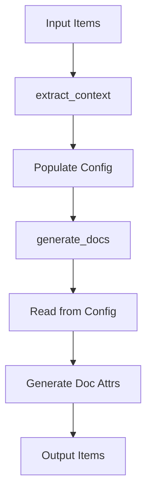

# Code Analysis: Open Files - Comprehensive Review

**Date**: 2026-02-10  
**Files Analyzed**:
- [`fp-macros/src/documentation/generation.rs`](../fp-macros/src/documentation/generation.rs)
- [`fp-macros/src/resolution/context.rs`](../fp-macros/src/resolution/context.rs)
- [`fp-macros/src/support/syntax.rs`](../fp-macros/src/support/syntax.rs)
- [`fp-macros/src/documentation/document_type_parameters.rs`](../fp-macros/src/documentation/document_type_parameters.rs)

---

## Executive Summary

The analyzed code is generally well-structured with clear separation of concerns, but exhibits several architectural and quality issues that could be improved:

- **High Code Duplication**: ImplKey creation pattern repeated 3 times
- **Inconsistent Error Handling**: Mixed patterns between `Result<()>` and `Vec<Error>`
- **Function Complexity**: Some functions exceed single responsibility principle
- **Dead Code Annotations**: Unclear if some code is truly dead or the annotation is incorrect
- **Naming Inconsistencies**: Mixed abbreviation styles

**Overall Quality**: Good (7/10) - Functional and tested, but needs refactoring for maintainability.

---

## 1. Code Duplication Issues

### 🔴 CRITICAL: ImplKey Creation Pattern (DRY Violation)

**Location**: Repeated 3 times across 2 files

The following pattern appears identically:
```rust
let impl_key = if let Some(ref t_path) = trait_path_str {
    ImplKey::with_trait(&self_ty_path, t_path)
} else {
    ImplKey::new(&self_ty_path)
};
```

**Occurrences**:
1. [`generation.rs:155-159`](../fp-macros/src/documentation/generation.rs:155)
2. [`generation.rs:219-223`](../fp-macros/src/documentation/generation.rs:219)
3. [`context.rs:140-144`](../fp-macros/src/resolution/context.rs:140)

**Impact**: 
- Maintenance burden - changes must be synchronized
- Increased risk of inconsistencies
- Code bloat

**Recommendation**: Extract to helper method in `ImplKey`:
```rust
impl ImplKey {
    pub fn from_paths(type_path: &str, trait_path: Option<&str>) -> Self {
        trait_path
            .map(|t| Self::with_trait(type_path, t))
            .unwrap_or_else(|| Self::new(type_path))
    }
}
```

---

### 🟡 MEDIUM: Doc Comment Formatting Pattern

**Location**: 3 occurrences

The pattern `format!("* `{name}`: {desc}")` appears in:
1. [`generation.rs:121`](../fp-macros/src/documentation/generation.rs:121)
2. [`generation.rs:168`](../fp-macros/src/documentation/generation.rs:168)
3. [`syntax.rs:181`](../fp-macros/src/support/syntax.rs:181)

**Recommendation**: Extract to a shared function:
```rust
pub fn format_param_doc(name: &str, desc: &str) -> String {
    format!("* `{name}`: {desc}")
}
```

**Benefits**:
- Centralized formatting logic
- Easy to change format globally
- Reduces typo risk

---

### 🟡 MEDIUM: Generic Parameter Validation

**Location**: Similar validation in 3 places

Empty generics validation appears with slight variations:
1. [`generation.rs:96-102`](../fp-macros/src/documentation/generation.rs:96) - Method parameters
2. [`context.rs:106-115`](../fp-macros/src/resolution/context.rs:106) - Impl parameters
3. [`document_type_parameters.rs:16-23`](../fp-macros/src/documentation/document_type_parameters.rs:16) - Generic validation

**Current Issues**:
- Error messages slightly different
- Similar logic with context-specific differences
- Could benefit from a shared validation helper

**Recommendation**: Create a validation helper that takes context:
```rust
pub fn require_type_params(
    generics: &syn::Generics,
    context: &str,
    span: proc_macro2::Span,
) -> Result<(), Error> {
    if generics.params.is_empty() {
        Err(Error::new(
            span,
            format!("{DOCUMENT_TYPE_PARAMETERS} cannot be used on {context} with no type parameters")
        ))
    } else {
        Ok(())
    }
}
```

---

### 🟢 LOW: Unused Parameter Pattern

**Location**: Multiple functions

Several functions receive parameters that are underscore-prefixed or unused:
1. [`generation.rs:31`](../fp-macros/src/documentation/generation.rs:31) - `_trait_name: Option<&str>`
2. [`generation.rs:86`](../fp-macros/src/documentation/generation.rs:86) - `impl_key: &ImplKey` (received but not used)

**Assessment**:
- `_trait_name`: Appears intentionally unused (future-proofing or legacy)
- `impl_key` in `process_doc_type_params`: Passed but never used

**Recommendation**: 
- Remove `impl_key` parameter from `process_doc_type_params` if truly unused
- Document why `_trait_name` is kept if it's for API stability

---

## 2. Architectural Issues

### 🔴 HIGH: Separation of Concerns in `generate_docs`

**Location**: [`generation.rs:137-240`](../fp-macros/src/documentation/generation.rs:137)

**Issue**: The `generate_docs` function does too much:
1. Iterates over items
2. Extracts trait/type information
3. Handles impl-level documentation
4. Handles method-level documentation
5. Manages error collection
6. Deals with `document_use` attribute resolution

**Current Structure**:
```
generate_docs (104 lines)
├── For each item
│   ├── Extract type/trait info
│   ├── Handle impl-level doc params
│   ├── Parse document_use
│   └── For each method
│       ├── Handle method document_use
│       ├── Process document_signature
│       └── Process document_type_params
```

**Recommendation**: Break into smaller functions:
```rust
pub(super) fn generate_docs(items: &mut [Item], config: &Config) -> Result<()> {
    let mut errors = ErrorCollector::new();
    
    for item in items {
        if let Item::Impl(item_impl) = item {
            errors.extend(process_impl_documentation(item_impl, config));
        }
    }
    
    errors.finish()
}

fn process_impl_documentation(
    item_impl: &mut syn::ItemImpl,
    config: &Config,
) -> Vec<Error> {
    // Extract common info once
    let impl_info = extract_impl_info(item_impl);
    let mut errors = Vec::new();
    
    // Process impl-level docs
    errors.extend(process_impl_level_docs(item_impl, &impl_info, config));
    
    // Process method-level docs
    errors.extend(process_methods(item_impl, &impl_info, config));
    
    errors
}
```

**Benefits**:
- Each function has single responsibility
- Easier to test individual pieces
- Reduced cognitive load
- Better code reusability

---

### 🟡 MEDIUM: Two-Phase Processing Complexity

**Issue**: Documentation generation requires two distinct phases:
1. **Context Extraction** ([`context.rs:extract_context`](../fp-macros/src/resolution/context.rs:16))
2. **Documentation Generation** ([`generation.rs:generate_docs`](../fp-macros/src/documentation/generation.rs:137))

**Current Flow**:


**Concerns**:
- Config acts as shared mutable state
- Easy to forget ordering requirement
- Attributes are processed but not removed in phase 1, removed in phase 2
- Split processing makes debugging harder

**Assessment**: This is likely intentional for the macro architecture, but worth noting as a complexity point.

**Recommendation**: 
- Add clear documentation about the two-phase requirement
- Consider adding validation that context extraction happened before generation
- Document why attributes aren't removed in phase 1

---

### 🟡 MEDIUM: Error Handling Inconsistency

**Issue**: Mixed error handling patterns across files:

| File | Pattern | Return Type |
|------|---------|-------------|
| `context.rs` | `ErrorCollector` + `Result<()>` | `Result<()>` |
| `generation.rs` | Manual `Vec<Error>` | `Result<()>` |
| Helper functions | Return `Vec<Error>` | `Vec<Error>` |

**Example Inconsistency**:
```rust
// context.rs - uses ErrorCollector
pub fn extract_context(items: &[Item], config: &mut Config) -> Result<()> {
    let mut errors = ErrorCollector::new();
    // ...
    errors.finish()
}

// generation.rs - manual Vec
pub(super) fn generate_docs(items: &mut [Item], config: &Config) -> Result<()> {
    let mut errors = ErrorCollector::new();
    // ...
    errors.finish()
}

// But helper functions return Vec<Error>
pub(super) fn process_document_signature(...) -> Vec<Error> {
    let mut errors = Vec::new();
    // ...
    errors
}
```

**Recommendation**: Standardize on one pattern:
- **Option A**: Always use `ErrorCollector` at all levels
- **Option B**: Always return `Vec<Error>` and collect at top level
- **Preferred**: Use `ErrorCollector` consistently as it provides better ergonomics

---

## 3. Dead Code & Unused Functionality

### 🟡 MEDIUM: `LogicalParam::Implicit` Annotation

**Location**: [`syntax.rs:249`](../fp-macros/src/support/syntax.rs:249)

**Issue**: The `Implicit` variant is marked with `#[allow(dead_code)]`:
```rust
pub enum LogicalParam {
    Explicit(syn::Pat),
    /// Note: Marked `#[allow(dead_code)]` but is actively used in curried parameter extraction
    /// and documentation generation.
    #[allow(dead_code)]
    Implicit(syn::Type),
}
```

**Contradiction**: Comment claims it's "actively used" but the allow directive suggests it's detected as dead code.

**Investigation Needed**:
- Is it actually used? (The compiler suggests no)
- Is it intended for future use?
- Is the comment outdated?

**Locations where it might be used**:
- [`syntax.rs:336`](../fp-macros/src/support/syntax.rs:336) - `push(LogicalParam::Implicit(...))`
- [`syntax.rs:380`](../fp-macros/src/support/syntax.rs:380) - `push(LogicalParam::Implicit(...))`

**Recommendation**: 
1. Remove the `#[allow(dead_code)]` and see if it actually compiles
2. If it's truly dead, consider why the variant exists
3. Update documentation to reflect actual usage
4. If it's only constructed but never matched on, that's a code smell

---

### 🟢 INFO: Unused Parameters

**Already documented in Code Duplication section**:
- `_trait_name` in `process_document_signature`
- `impl_key` in `process_doc_type_params`

---

## 4. Naming and Clarity Issues

### 🟡 MEDIUM: Inconsistent Function Naming

**Issue**: Abbreviation style varies:

| Function | Style | Location |
|----------|-------|----------|
| `process_document_signature` | Full word | `generation.rs:26` |
| `process_doc_type_params` | Abbreviated | `generation.rs:82` |
| `extract_context` | Full | `context.rs:16` |
| `generate_docs` | Abbreviated | `generation.rs:137` |

**Recommendation**: Choose one style consistently:
- **Option A**: Always abbreviate: `process_doc_sig`, `process_doc_params`
- **Option B**: Never abbreviate: `process_document_signature`, `process_document_type_parameters`, `generate_documentation`
- **Preferred**: Be consistent within a module - if one is abbreviated, all should be

---

### 🟡 MEDIUM: Variable Naming Clarity

**Issue 1: Generic "entry" names**
```rust
// generation.rs:108
let entries: Vec<_> = args.entries.iter().collect();
// ...
for (name_from_target, entry) in method_param_names.iter().zip(entries) {
    let (name, desc) = match entry {
        DocArg::Override(n, d) => (n.value(), d.value()),
        DocArg::Desc(d) => (name_from_target.clone(), d.value()),
    };
```

**Better naming**:
```rust
let doc_args: Vec<_> = args.entries.iter().collect();
for (param_name, doc_arg) in method_param_names.iter().zip(doc_args) {
    let (display_name, description) = match doc_arg {
        DocArg::Override(name, desc) => (name.value(), desc.value()),
        DocArg::Desc(desc) => (param_name.clone(), desc.value()),
    };
```

**Issue 2: `synthetic_sig`**
```rust
// generation.rs:40
let mut synthetic_sig = method.sig.clone();
```

**Better name**: `resolved_sig` or `self_resolved_sig` to indicate it's been processed to replace `Self` references.

---

### 🟢 LOW: Path String Variables

**Issue**: Variables like `self_ty_path`, `trait_path_str` are consistent but could be clearer:

```rust
let self_ty_path = quote!(#self_ty).to_string();
let trait_path_str = trait_path.map(|p| quote!(#p).to_string());
```

**Assessment**: These names are actually reasonable. The `_str` suffix on `trait_path_str` is good. Consider adding `_str` consistently to `self_ty_path` → `self_ty_path_str` for uniformity.

---

## 5. Error Handling Patterns

### 🔴 MEDIUM: Error Context Loss

**Issue**: Some errors lose context about where they originated:

```rust
// generation.rs:97-101
errors.push(Error::new(
    attr.span(),
    format!("{DOCUMENT_TYPE_PARAMETERS} cannot be used on methods with no type parameters"),
));
```

**Better**:
```rust
errors.push(Error::new(
    attr.span(),
    format!(
        "{DOCUMENT_TYPE_PARAMETERS} cannot be used on method '{}' with no type parameters",
        method.sig.ident
    ),
));
```

**Benefits**:
- User knows exactly which method has the problem
- Better debugging experience
- More actionable error messages

---

### 🟡 MEDIUM: Span Usage Consistency

**Issue**: Some error messages use attribute span, others use item span:

```rust
// Uses attr.span()
Error::new(attr.span(), "Failed to parse...")

// Uses generics.span()
Error::new(generics.span(), "cannot be used on items...")
```

**Recommendation**: Document a policy:
- Attribute errors → use `attr.span()` (points to the attribute)
- Structural errors → use item span (points to the item itself)

---

### 🟢 LOW: Error Message Consistency

**Observation**: Error messages follow a consistent pattern, which is good:
```rust
format!("{DOCUMENT_TYPE_PARAMETERS} cannot be used on...")
```

The use of the constant `DOCUMENT_TYPE_PARAMETERS` ensures consistency.

---

## 6. Function Complexity

### 🔴 HIGH: `process_document_signature` - Too Many Parameters

**Location**: [`generation.rs:26`](../fp-macros/src/documentation/generation.rs:26)

**Current Signature**:
```rust
#[allow(clippy::too_many_arguments)]
pub(super) fn process_document_signature(
    method: &mut syn::ImplItemFn,
    attr_pos: usize,
    self_ty: &syn::Type,
    self_ty_path: &str,
    _trait_name: Option<&str>,
    trait_path_str: Option<&str>,
    document_use: Option<&str>,
    item_impl_generics: &syn::Generics,
    config: &Config,
) -> Vec<Error>
```

**Issue**: 9 parameters (with clippy warning suppressed)

**Recommendation**: Introduce a context struct:
```rust
pub struct ImplContext<'a> {
    self_ty: &'a syn::Type,
    self_ty_path: &'a str,
    trait_path: Option<&'a str>,
    document_use: Option<&'a str>,
    impl_generics: &'a syn::Generics,
}

pub(super) fn process_document_signature(
    method: &mut syn::ImplItemFn,
    attr_pos: usize,
    context: &ImplContext,
    config: &Config,
) -> Vec<Error>
```

**Benefits**:
- Cleaner function signature
- Context can be reused across multiple methods
- Easier to extend with new fields
- No clippy warnings needed

---

### 🔴 MEDIUM: `generate_docs` - High Cyclomatic Complexity

**Location**: [`generation.rs:137-240`](../fp-macros/src/documentation/generation.rs:137)

**Metrics**:
- Lines: 104
- Nesting levels: 4
- Branches: Multiple if/match statements
- Responsibilities: 5+

**Already covered in Architecture section** - see recommendation to break into smaller functions.

---

### 🟡 MEDIUM: `extract_context` - Similar Complexity

**Location**: [`context.rs:16-210`](../fp-macros/src/resolution/context.rs:16)

**Metrics**:
- Lines: 195
- Nested matching on `Item::Macro`, `Item::Impl`
- Multiple responsibilities: projections, defaults, documentation

**Recommendation**: Similar to `generate_docs`, break into smaller functions:
```rust
pub fn extract_context(items: &[Item], config: &mut Config) -> Result<()> {
    let mut errors = ErrorCollector::new();
    
    for item in items {
        match item {
            Item::Macro(m) => errors.extend(extract_from_macro(m, config)),
            Item::Impl(i) => errors.extend(extract_from_impl(i, config)),
            _ => {}
        }
    }
    
    errors.finish()
}
```

---

## 7. Refactoring Opportunities

### 🔴 HIGH PRIORITY: Extract ImplKey Creation Helper

**Effort**: Low  
**Impact**: High  
**Location**: Multiple files

**Implementation**:
```rust
// In fp-macros/src/resolution/impl_key.rs
impl ImplKey {
    /// Create an ImplKey from type and optional trait paths
    pub fn from_paths(type_path: &str, trait_path: Option<&str>) -> Self {
        trait_path
            .map(|t| Self::with_trait(type_path, t))
            .unwrap_or_else(|| Self::new(type_path))
    }
}
```

**Usage**:
```rust
// Before
let impl_key = if let Some(ref t_path) = trait_path_str {
    ImplKey::with_trait(&self_ty_path, t_path)
} else {
    ImplKey::new(&self_ty_path)
};

// After
let impl_key = ImplKey::from_paths(&self_ty_path, trait_path_str.as_deref());
```

---

### 🔴 HIGH PRIORITY: Introduce ImplContext Struct

**Effort**: Medium  
**Impact**: High  
**Benefits**: Reduces parameter count, improves maintainability

**Implementation**: See section 6 for details.

---

### 🟡 MEDIUM PRIORITY: Break Down Large Functions

**Target Functions**:
1. `generate_docs` (104 lines) → 3-4 smaller functions
2. `extract_context` (195 lines) → 3-4 smaller functions

**Effort**: Medium  
**Impact**: Medium-High  
**Benefits**: Better testability, readability, maintainability

---

### 🟡 MEDIUM PRIORITY: Standardize Error Handling

**Effort**: Low  
**Impact**: Medium  
**Target**: Consistent use of `ErrorCollector` pattern

---

### 🟢 LOW PRIORITY: Extract Doc Formatting

**Effort**: Low  
**Impact**: Low  
**Note**: Nice to have, but not critical

---

## 8. Best Practices Assessment

### ✅ Strengths

1. **Good Module Organization**: Clear separation between documentation, resolution, support
2. **Type Safety**: Strong use of newtypes like `ImplKey`, `ProjectionKey`
3. **Testing**: All modules include comprehensive unit tests
4. **Documentation**: Most public items have doc comments
5. **Error Handling**: Errors use `syn::Error` with proper span information
6. **Constants**: Use of constants for attribute names (`DOCUMENT_TYPE_PARAMETERS`)

### ⚠️ Areas for Improvement

1. **DRY Violations**: Repeated patterns need extraction
2. **Function Length**: Some functions exceed recommended length
3. **Parameter Count**: Some functions have too many parameters
4. **Naming Consistency**: Mixed abbreviation styles
5. **Error Context**: Could provide more helpful error messages

---

## 9. Recommended Action Plan

### Phase 1: High-Impact, Low-Effort (Do First)

1. **Extract `ImplKey::from_paths` helper** 
   - Files: 2
   - Lines saved: ~12
   - Complexity reduction: High

2. **Extract doc comment formatting helper**
   - Files: 2  
   - Lines saved: ~6
   - Consistency improvement: High

3. **Fix inconsistent function naming**
   - Rename either `process_doc_type_params` → `process_document_type_parameters` or vice versa
   - Choose one style and apply consistently

### Phase 2: Medium-Impact, Medium-Effort

4. **Introduce `ImplContext` struct**
   - Reduces `process_document_signature` from 9 to 4 parameters
   - Can be reused across functions
   - Better encapsulation

5. **Standardize error handling pattern**
   - Use `ErrorCollector` consistently
   - Add more context to error messages

6. **Investigate `LogicalParam::Implicit` dead code**
   - Determine if it's truly unused
   - Remove `#[allow(dead_code)]` or the variant itself

### Phase 3: High-Impact, Higher-Effort

7. **Refactor `generate_docs`**
   - Break into 3-4 focused functions
   - Improve testability
   - Reduce cognitive load

8. **Refactor `extract_context`**
   - Similar decomposition as `generate_docs`
   - Separate concerns more clearly

### Phase 4: Documentation & Polish

9. **Document two-phase architecture**
   - Add module-level docs explaining extract → generate flow
   - Document ordering requirements
   - Add validation if possible

10. **Improve error messages**
    - Add method/item names to error context
    - Make errors more actionable

---

## 10. Severity Legend

- 🔴 **CRITICAL/HIGH**: Should be addressed soon - impacts maintainability significantly
- 🟡 **MEDIUM**: Should be addressed eventually - impacts code quality
- 🟢 **LOW/INFO**: Nice to have - minor improvements

---

## 11. Summary Metrics

| Metric | Count | Status |
|--------|-------|--------|
| Code Duplication Issues | 4 | 🔴 High |
| Architectural Issues | 3 | 🟡 Medium |
| Dead Code Items | 2 | 🟡 Medium |
| Naming Issues | 3 | 🟡 Medium |
| Error Handling Issues | 3 | 🟡 Medium |
| Complex Functions | 3 | 🔴 High |
| Refactoring Opportunities | 8 | - |

**Overall Assessment**: The codebase is functional and well-tested, but would benefit significantly from refactoring to improve maintainability. The main issues are code duplication and function complexity, both of which can be addressed with relatively straightforward refactoring.

---

## 12. Additional Notes

### Positive Observations

- **Consistent Patterns**: Despite duplication, the patterns themselves are consistent
- **Error Recovery**: Good use of error collection to continue processing
- **Testing**: Strong test coverage gives confidence for refactoring
- **Type Safety**: Good use of Rust's type system

### Future Considerations

- Consider introducing a builder pattern for complex construction scenarios
- Evaluate if a visitor pattern would simplify traversal logic
- Consider trait-based abstractions for documentation generation

---

**End of Analysis**
