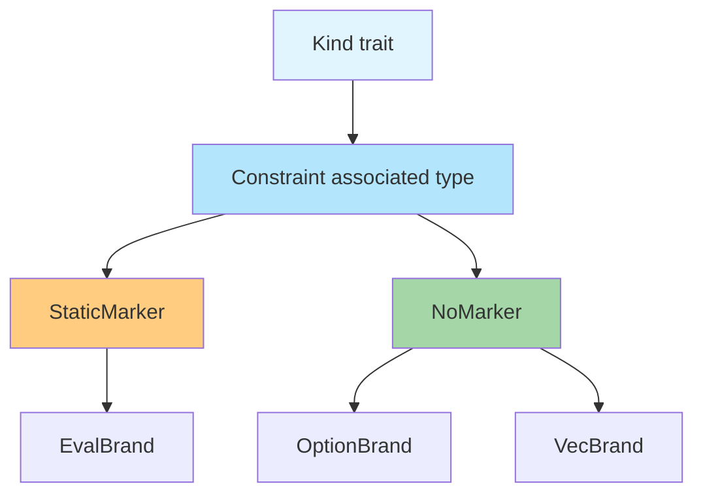

# Eval HKT Compatibility Analysis

## Executive Summary

This document analyzes two critical issues identified in the review of `docs/lazy-analysis/hybrid-stack-safety-proposal.md` and evaluates proposed solutions along with alternatives.

**Issue 1**: The `Eval<A>` type requires `A: 'static` due to `Box<dyn Any>` type erasure, but HKT traits like `Semimonad` are generic over lifetimes `'a`. This creates a fundamental incompatibility.

**Issue 2**: The `tail_rec_m` implementation needs to use function `f` multiple times across iterations, causing ownership conflicts with Rust's borrow checker.

---

## Issue 1: HKT Trait vs `'static` Constraint

### The Problem

The current HKT trait signature for [`Semimonad::bind`](../../fp-library/src/classes/semimonad.rs:53-58):

```rust
pub trait Semimonad: Kind_cdc7cd43dac7585f {
    fn bind<'a, B: 'a, A: 'a, F>(
        ma: Apply!(...Self::Of<'a, A>),
        f: F,
    ) -> Apply!(...Self::Of<'a, B>)
    where
        F: Fn(A) -> Apply!(...Self::Of<'a, B>) + 'a;
}
```

The `'a` lifetime parameter means the trait promises to work for **any** lifetime. However, `Eval::flat_map` fundamentally requires `A: 'static` because:

1. Internal type erasure uses `Box<dyn Any + Send>`
2. `std::any::Any` trait has `'static` as a supertrait bound
3. `TypeId::of::<T>()` requires `T: 'static`

**Compilation failure**: Rust will reject an `impl Semimonad for EvalBrand` because the implementation has stricter requirements (`'static`) than the trait definition (`'a`).

### Solution Analysis

#### Approach A: Constraint Markers (User's Proposal)

**Mechanism:**

```rust
/// Bridge trait: T satisfies constraint C if implemented
pub trait ToConstraint<C: ?Sized> {}

/// Marker for 'static requirement
pub trait StaticMarker {}
impl<T: 'static> ToConstraint<dyn StaticMarker> for T {}

/// Marker for no extra requirements
pub trait NoMarker {}
impl<T: ?Sized> ToConstraint<dyn NoMarker> for T {}

/// Extended Kind trait with constraint declaration
pub trait Kind {
    type Constraint: ?Sized;
    type Of<'a, A: 'a>: 'a
    where
        A: ToConstraint<Self::Constraint>;
}
```

**How it works:**

- Each brand declares its `Constraint` associated type
- Type class traits propagate `ToConstraint` bounds
- When `EvalBrand` sets `Constraint = dyn StaticMarker`, only `'static` types satisfy the bound
- The constraint becomes part of the **trait signature**, not just the impl

**Trade-offs:**

| Aspect            | Pro                                  | Con                                       |
| ----------------- | ------------------------------------ | ----------------------------------------- |
| **Unification**   | Single trait hierarchy for all types | All traits must carry ToConstraint bounds |
| **Type Safety**   | Compile-time enforcement             | More complex trait bounds                 |
| **Ergonomics**    | Brands self-declare constraints      | Developers must understand marker system  |
| **Migration**     | Existing types use `NoMarker`        | Requires updating all type class traits   |
| **Macro Changes** | Can be automated                     | Macros need modification                  |

**Compatibility with existing system:**

The current [`def_kind!`](../../fp-macros/src/def_kind.rs) macro would need modification to:

1. Add `Constraint` associated type to generated Kind traits
2. Add `where A: ToConstraint<Self::Constraint>` to GAT bounds

The [`Semimonad`](../../fp-library/src/classes/semimonad.rs:20) and other type classes would need updated signatures:

```rust
pub trait Semimonad: Kind_cdc7cd43dac7585f {
    fn bind<'a, B: 'a, A: 'a, F>(
        ma: Apply!(...),
        f: F,
    ) -> Apply!(...)
    where
        A: ToConstraint<Self::Constraint>,
        B: ToConstraint<Self::Constraint>,
        F: Fn(A) -> Apply!(...) + 'a;
}
```

**Verdict**: ✅ **Recommended** - This is the most elegant solution that maintains a unified type class hierarchy while allowing brands to declare their constraints.

---

#### Approach B: Separate Static Trait Hierarchy

**Mechanism:**

Create parallel traits with baked-in `'static` bounds:

```rust
pub trait StaticSemimonad: Kind_cdc7cd43dac7585f {
    fn bind<A: 'static + Send, B: 'static + Send, F>(
        ma: Self::Of<'static, A>,
        f: F,
    ) -> Self::Of<'static, B>
    where
        F: Fn(A) -> Self::Of<'static, B> + 'static + Send;
}
```

**Trade-offs:**

| Aspect          | Pro                           | Con                                   |
| --------------- | ----------------------------- | ------------------------------------- |
| **Simplicity**  | No changes to existing traits | Duplicates entire hierarchy           |
| **Separation**  | Clean boundary                | Cannot use Eval in generic Monad code |
| **Maintenance** | Each hierarchy is simpler     | Two hierarchies to maintain           |

**Verdict**: ⚠️ **Acceptable** - Use only if Approach A proves too complex. Loses composability.

---

#### Approach C: Eval Outside HKT Hierarchy

**Mechanism:**

Accept that `Eval` doesn't implement standard HKT traits. It has standalone methods:

```rust
impl<A: 'static + Send> Eval<A> {
    pub fn flat_map<B, F>(self, f: F) -> Eval<B> { ... }
    pub fn map<B, F>(self, f: F) -> Eval<B> { ... }
}
// No impl Semimonad for EvalBrand
```

**Trade-offs:**

| Aspect         | Pro                   | Con                           |
| -------------- | --------------------- | ----------------------------- |
| **Simplicity** | No HKT system changes | Eval unusable in generic code |
| **Pragmatism** | Works immediately     | Defeats purpose of HKT system |

**Verdict**: ❌ **Not recommended** - Undermines the FP library's goal of unified abstractions.

---

#### Approach D: Defunctionalized Free Monad

**Mechanism:**

Avoid `Box<dyn Any>` entirely by using a fully-typed continuation representation:

```rust
enum Free<F, A> {
    Pure(A),
    Roll(F::Of<Free<F, A>>),
    FlatMap {
        // Type-preserving continuation chain via nested types
        inner: Box<Free<F, Erased>>,
        cont: PhantomData<...>,
    }
}
```

This is conceptually similar to Haskell's operational monad approach but requires complex type-level programming.

**Trade-offs:**

| Aspect          | Pro                    | Con                              |
| --------------- | ---------------------- | -------------------------------- |
| **Type Safety** | Full static typing     | Extremely complex implementation |
| **Lifetimes**   | Could support `'a`     | May not be expressible in Rust   |
| **Performance** | No runtime downcasting | Compile-time explosion           |

**Verdict**: ❌ **Not recommended** - Likely not feasible in Rust without GADTs.

---

#### Approach E: Phantom Lifetime with Unsafe

**Mechanism:**

Create a custom `Any`-like trait that doesn't require `'static`:

```rust
trait AnyLifetime<'a>: 'a {
    fn type_id_if_static(&self) -> Option<TypeId>;
    unsafe fn downcast_unchecked<T>(self: Box<Self>) -> T;
}
```

**Trade-offs:**

| Aspect          | Pro                     | Con                  |
| --------------- | ----------------------- | -------------------- |
| **Flexibility** | Works with any lifetime | Unsafe code required |
| **Soundness**   | Possible                | Easy to cause UB     |
| **Maintenance** | N/A                     | Security nightmare   |

**Verdict**: ❌ **Never recommended** - Too dangerous for a library.

---

### Issue 1 Recommendation

**Primary**: Implement **Approach A (Constraint Markers)**



**Fallback**: If constraint markers prove too complex, use **Approach B (Separate Hierarchy)** with clear documentation about the trade-off.

---

## Issue 2: MonadRec Closure Ownership

### The Problem

In the [`tail_rec_m`](hybrid-stack-safety-proposal.md:3866-3886) implementation:

```rust
fn go<A, B>(
    f: impl Fn(A) -> Eval<Step<A, B>> + Send + 'static,
    a: A,
) -> Eval<B> {
    Eval::defer(move || {
        f(a).flat_map(|step| match step {
            Step::Loop(next) => go(f, next),  // f moved here!
            Step::Done(b) => Eval::now(b),
        })
    })
}
```

The function `f`:

1. Is moved into the `defer` closure
2. Is called as `f(a)`
3. Must be moved again into `flat_map`'s closure for `go(f, next)`

Rust's ownership rules don't allow moving a value after it's been used, unless we clone it.

### Solution Analysis

#### Approach A: Clone Bound (User's Proposal)

**Mechanism:**

```rust
fn tail_rec_m<'a, A: 'a, B: 'a, F>(f: F, a: A) -> Eval<B>
where
    F: Fn(A) -> Eval<Step<A, B>> + Send + 'static + Clone,
{
    fn go<A, B, F>(f: F, a: A) -> Eval<B>
    where
        F: Fn(A) -> Eval<Step<A, B>> + Send + 'static + Clone
    {
        Eval::defer(move || {
            let f_next = f.clone();  // Clone for next iteration
            f(a).flat_map(move |step| match step {
                Step::Loop(next) => go(f_next, next),
                Step::Done(b) => Eval::now(b),
            })
        })
    }
    go(f, a)
}
```

**Trade-offs:**

| Aspect          | Pro                      | Con                         |
| --------------- | ------------------------ | --------------------------- |
| **Simplicity**  | Clear, idiomatic Rust    | Requires Clone on F         |
| **Ergonomics**  | Most closures are Clone  | Some closures are not Clone |
| **Performance** | Clone is typically cheap | One clone per iteration     |

**When closures are Clone:**

Closures implement `Clone` if all their captures implement `Clone`. This includes:

- All primitives
- `String`, `Vec<T>` where T: Clone
- `Arc<T>`, `Rc<T>`
- References `&T`

**When closures are NOT Clone:**

- Captures `Box<T>`
- Captures `Mutex<T>` by value
- Captures any non-Clone type

**Verdict**: ✅ **Recommended** - Simple and covers most use cases.

---

#### Approach B: Arc Wrapper (Internal)

**Mechanism:**

Wrap `f` in `Arc` internally, hiding the cloning:

```rust
fn tail_rec_m<A: 'static, B: 'static, F>(f: F, a: A) -> Eval<B>
where
    F: Fn(A) -> Eval<Step<A, B>> + Send + 'static,  // No Clone!
{
    let f = Arc::new(f);

    fn go<A: 'static, B: 'static, F>(f: Arc<F>, a: A) -> Eval<B>
    where
        F: Fn(A) -> Eval<Step<A, B>> + Send + 'static,
    {
        let f_next = Arc::clone(&f);
        Eval::defer(move || {
            f(a).flat_map(move |step| match step {
                Step::Loop(next) => go(f_next, next),
                Step::Done(b) => Eval::now(b),
            })
        })
    }
    go(f, a)
}
```

**Trade-offs:**

| Aspect          | Pro                      | Con                        |
| --------------- | ------------------------ | -------------------------- |
| **API**         | No Clone bound required  | Hidden allocation          |
| **Flexibility** | Works with any closure   | Arc overhead per call      |
| **Performance** | Arc::clone is atomic inc | Slightly slower than Clone |

**Verdict**: ✅ **Alternative** - Good option if Clone bound is too restrictive.

---

#### Approach C: Provide Both APIs

**Mechanism:**

Offer two versions:

```rust
// Fast path - requires Clone
fn tail_rec_m<A, B, F>(f: F, a: A) -> Eval<B>
where
    F: Fn(A) -> Eval<Step<A, B>> + Send + 'static + Clone;

// Flexible path - uses Arc internally
fn tail_rec_m_shared<A, B, F>(f: F, a: A) -> Eval<B>
where
    F: Fn(A) -> Eval<Step<A, B>> + Send + 'static;
```

**Trade-offs:**

| Aspect            | Pro                       | Con                        |
| ----------------- | ------------------------- | -------------------------- |
| **Choice**        | User picks based on needs | API surface grows          |
| **Documentation** | Clear trade-offs          | Users must understand both |

**Verdict**: ⚠️ **Consider** - Useful if both patterns are common.

---

#### Approach D: Box dyn Fn with Internal Clone

**Mechanism:**

Use trait objects:

```rust
fn tail_rec_m<A: 'static, B: 'static>(
    f: Box<dyn Fn(A) -> Eval<Step<A, B>> + Send>,
    a: A,
) -> Eval<B>
```

But `Box<dyn Fn>` is not Clone by default. Would need custom wrapper.

**Verdict**: ❌ **Not recommended** - Adds complexity without benefit over Arc.

---

### Issue 2 Recommendation

**Primary**: Implement **Approach A (Clone bound)**

Most closures in practice implement Clone. Document the requirement clearly:

```rust
/// Performs tail-recursive monadic computation.
///
/// # Closure Requirements
///
/// The function `f` must implement `Clone`. This is satisfied when:
/// - All captured variables implement `Clone`
/// - Closures capture by reference or use `Arc` for shared state
///
/// If your closure cannot be Clone, use [`tail_rec_m_shared`] instead.
fn tail_rec_m<A: 'static, B: 'static, F>(f: F, a: A) -> Eval<B>
where
    F: Fn(A) -> Eval<Step<A, B>> + Send + 'static + Clone;
```

**Secondary**: Also provide **Approach B (Arc version)** as `tail_rec_m_shared` for cases where Clone is not possible.

---

## Implementation Plan

### Phase 1: Constraint Marker System

1. Define marker traits and `ToConstraint` bridge
2. Add `Constraint` associated type to Kind traits
3. Update `def_kind!` macro to include constraint bounds
4. Update `impl_kind!` macro to handle constraints
5. Add `ToConstraint` bounds to all type class traits

### Phase 2: Eval Implementation

1. Implement `Eval` with `'static` constraint
2. Implement `EvalBrand` with `Constraint = dyn StaticMarker`
3. Implement type class instances for `EvalBrand`
4. Implement `tail_rec_m` with Clone bound
5. Implement `tail_rec_m_shared` with Arc wrapper

### Phase 3: Testing and Documentation

1. Write tests verifying Eval works with HKT system
2. Write tests for tail_rec_m with various closure types
3. Document the constraint marker system
4. Add examples showing Eval in generic code

---

## Questions for User

1. **Constraint Markers**: Should `NoMarker` be the default, or should we require explicit constraint declaration for all brands?

2. **Naming**: Should the Arc-based tail recursion be called `tail_rec_m_shared`, `tail_rec_m_arc`, or something else?

3. **Additional Markers**: Should we pre-define markers for other common constraints like `Send`, `Sync`, or `Send + 'static`?

4. **Macro Updates**: Should the constraint system be opt-in for existing traits, or should we do a breaking change to add it everywhere?
