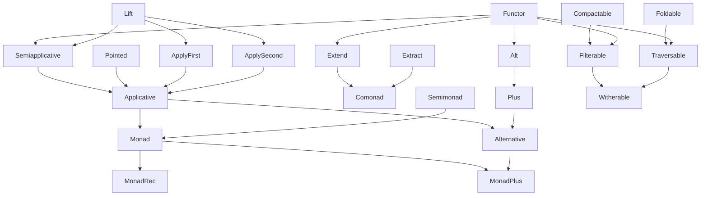
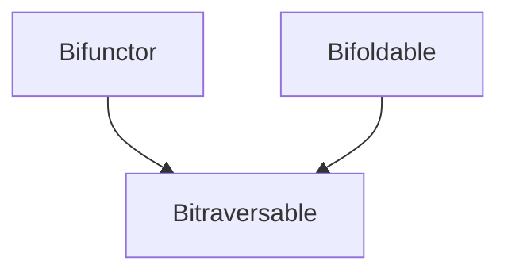
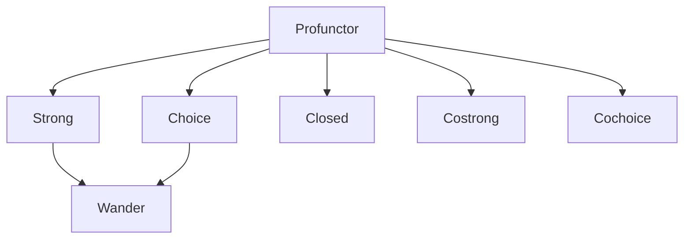
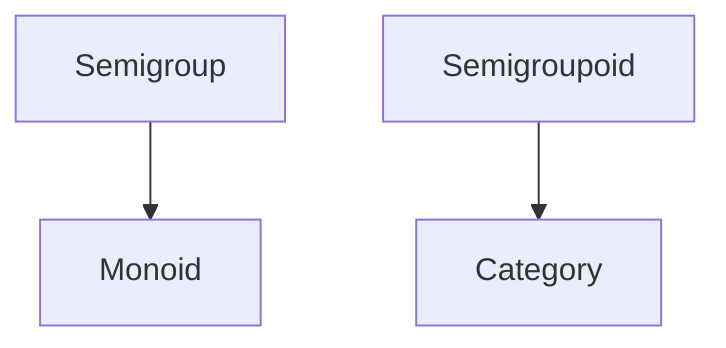

## Features

### Higher-Kinded Types (HKT)

Implemented using lightweight higher-kinded polymorphism (type-level defunctionalization/brands).
Procedural macros (`trait_kind!`, `impl_kind!`, `Apply!`, `#[kind]`) simplify defining and
applying HKT encodings. `m_do!` provides monadic do-notation; `a_do!` provides applicative
do-notation. Both support a `ref` qualifier for by-reference dispatch and an inferred mode
(`m_do!({ ... })`) where the brand is inferred from container types.

### Brand Inference

For types with a single unambiguous brand (Option, Vec, Identity, Thunk, Lazy, etc.),
free functions like `map`, `bind`, `fold_right`, and `bimap` infer the brand automatically
from the container type via `InferableBrand` traits. No turbofish needed:

```rust
use fp_library::functions::*;

let y = map(|x: i32| x + 1, Some(5));                     // infers OptionBrand
let z: Vec<i32> = bind(vec![1, 2], |x: i32| vec![x, x*10]); // infers VecBrand
let w = bimap((|e: i32| e+1, |s: i32| s*2), Ok::<i32, i32>(5)); // infers ResultBrand
# assert_eq!(y, Some(6));
# assert_eq!(z, vec![1, 10, 2, 20]);
# assert_eq!(w, Ok(10));
```

Types with multiple brands (Result at arity 1, Tuple2, Pair, ControlFlow) require the
`_explicit` variants (`map_explicit::<Brand, ...>`) for arity-1 operations.

`InferableBrand` traits are auto-generated by `trait_kind!` and `impl_kind!`. The
`#[no_inferable_brand]` attribute on `impl_kind!` suppresses generation for multi-brand types.

### Type Class Hierarchy

The library provides a comprehensive set of type classes. Blanket implementations
automatically derive composite traits (`Applicative`, `Monad`, `Comonad`, `Alternative`,
`MonadPlus`) from their components.









**Indexed variants:** `FunctorWithIndex`, `FoldableWithIndex`, `TraversableWithIndex`,
`FilterableWithIndex` extend their base traits with a shared `WithIndex` associated index type.

**Parallel variants:** `ParFunctor`, `ParFoldable`, `ParCompactable`, `ParFilterable`,
`ParFunctorWithIndex`, `ParFoldableWithIndex`, `ParFilterableWithIndex` mirror the sequential
hierarchy with `Send + Sync` bounds. Enable the `rayon` feature for true parallel execution.

**By-reference hierarchy:** A full by-ref type class stack for memoized types and
by-reference iteration over collections:

- `RefFunctor`, `RefPointed`, `RefLift`, `RefSemiapplicative`, `RefSemimonad`,
  `RefApplicative`, `RefMonad`, `RefApplyFirst`, `RefApplySecond`
- `RefFoldable`, `RefTraversable`, `RefFilterable`, `RefWitherable`
- `RefFunctorWithIndex`, `RefFoldableWithIndex`, `RefFilterableWithIndex`,
  `RefTraversableWithIndex`

**Thread-safe by-reference:** `SendRefFunctor`, `SendRefPointed`, `SendRefLift`,
`SendRefSemiapplicative`, `SendRefSemimonad`, `SendRefApplicative`, `SendRefMonad`,
`SendRefFoldable`, `SendRefFoldableWithIndex`, `SendRefFunctorWithIndex`,
`SendRefApplyFirst`, `SendRefApplySecond`.

**Parallel by-reference:** `ParRefFunctor`, `ParRefFoldable`, `ParRefFilterable`,
`ParRefFunctorWithIndex`, `ParRefFoldableWithIndex`, `ParRefFilterableWithIndex`.

**Laziness and effects:** `Deferrable`, `SendDeferrable` for lazy construction.
`LazyConfig` for memoization strategy abstraction.

### Optics

Composable data accessors using profunctor encoding (port of PureScript's
`purescript-profunctor-lenses`): Iso, Lens, Prism, AffineTraversal, Traversal, Getter,
Setter, Fold, Review, Grate. Each has a monomorphic `Prime` variant. Indexed variants
available for Lens, Traversal, Getter, Fold, Setter. Zero-cost composition via `Composed`
and `optics_compose`.

### Data Types

**Standard library instances:** `Option`, `Result`, `Vec`, `String` implement relevant
type classes.

**Lazy evaluation and stack safety:**

| Type                                  | Purpose                                       |
| ------------------------------------- | --------------------------------------------- |
| `Thunk` / `SendThunk`                 | Lightweight deferred computation.             |
| `Trampoline`                          | Stack-safe recursion via the `Free` monad.    |
| `Lazy` (`RcLazy`, `ArcLazy`)          | Memoized (evaluate-at-most-once) computation. |
| `TryThunk` / `TrySendThunk`           | Fallible deferred computation.                |
| `TryTrampoline`                       | Fallible stack-safe recursion.                |
| `TryLazy` (`RcTryLazy`, `ArcTryLazy`) | Fallible memoized computation.                |

**Free functors:**

| Type               | Wrapper | Clone | Send        | Map fusion   |
| ------------------ | ------- | ----- | ----------- | ------------ |
| `Coyoneda`         | `Box`   | No    | No          | No (k calls) |
| `RcCoyoneda`       | `Rc`    | Yes   | No          | No (k calls) |
| `ArcCoyoneda`      | `Arc`   | Yes   | Yes         | No (k calls) |
| `CoyonedaExplicit` | None    | No    | Conditional | Yes (1 call) |

**Containers:** `Identity`, `Pair`, `CatList` (O(1) append/uncons catenable list).

**Function wrappers:** `Endofunction` (dynamically composed `a -> a`), `Endomorphism`
(monoidally composed `a -> a`).

### Numeric Algebra

`Semiring`, `Ring`, `CommutativeRing`, `EuclideanRing`, `DivisionRing`, `Field`,
`HeytingAlgebra`.

### Newtype Wrappers

`Additive`, `Multiplicative`, `Conjunctive`, `Disjunctive`, `First`, `Last`, `Dual`
for selecting `Semigroup`/`Monoid` instances.

### Helper Functions

`compose`, `constant`, `flip`, `identity`, `on`, `pipe`.
