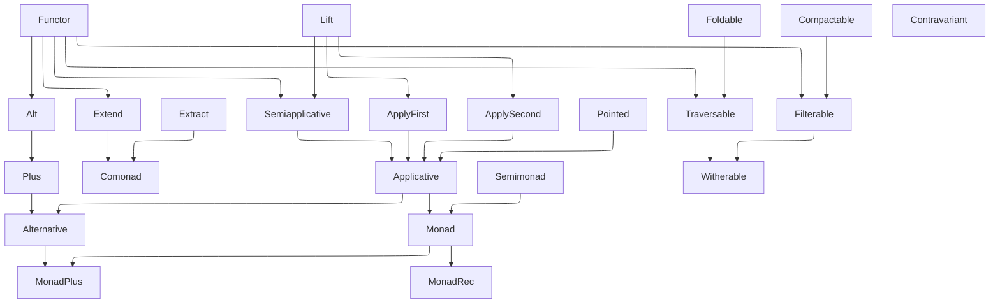
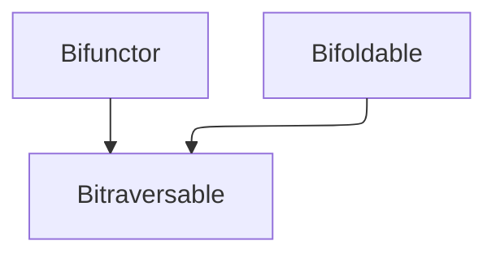
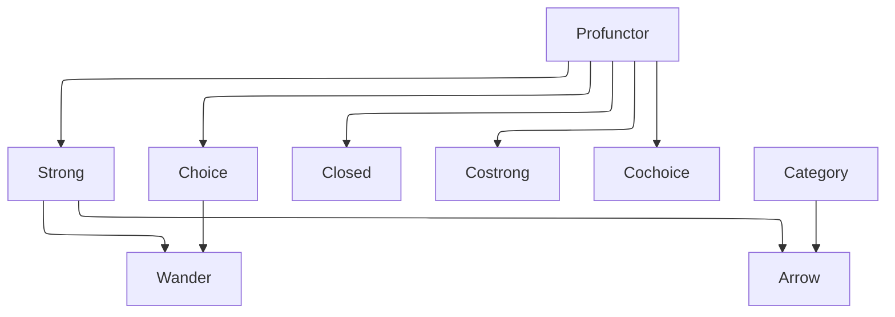
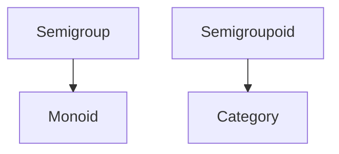

## Features

### Higher-Kinded Types (HKT)

Implemented via lightweight higher-kinded polymorphism (brand pattern). Write generic code
over `Functor`, `Monad`, `Traversable`, etc. that works with `Option`, `Result`, `Vec`,
or your own types. Procedural macros (`trait_kind!`, `impl_kind!`, `Apply!`,
`InferableBrand!`) simplify defining and applying HKT encodings. `m_do!` provides monadic
do-notation; `a_do!` provides applicative do-notation. Both support a `ref` qualifier for
by-reference dispatch and an inferred mode (`m_do!({ ... })`) where the brand is inferred
from container types. See [Higher-Kinded Types](./hkt.md).

### Brand Inference

For types with a single unambiguous brand (Option, Vec, Identity, Thunk, Lazy, etc.),
free functions like `map`, `bind`, `fold_right`, and `bimap` infer the brand automatically
from the container type via `InferableBrand` traits. No turbofish needed:

```rust
use fp_library::functions::*;

let y = map(|x: i32| x + 1, Some(5));                           // infers OptionBrand
let z: Vec<i32> = bind(vec![1, 2], |x: i32| vec![x, x*10]);     // infers VecBrand
let w = bimap((|e: i32| e+1, |s: i32| s*2), Ok::<i32, i32>(5)); // infers ResultBrand
assert_eq!(y, Some(6));
assert_eq!(z, vec![1, 10, 2, 20]);
assert_eq!(w, Ok(10));
```

Types with multiple brands (Result at arity 1, Tuple2, Pair, ControlFlow) require the
`explicit::` variants (`explicit::map::<Brand, ...>`) for arity-1 operations.

`InferableBrand` traits are auto-generated by `trait_kind!` and `impl_kind!`. The
`#[no_inferable_brand]` attribute on `impl_kind!` suppresses generation for multi-brand types.
See [Brand Inference](./brand-inference.md).

### Val/Ref Dispatch

Each free function routes to either a by-value or by-reference trait method based on the
closure's argument type. Closureless operations (`alt`, `compact`, etc.) dispatch based on
container ownership instead. This means a single `map` function handles both
`map(|x: i32| x + 1, Some(5))` (owned, dispatches to `Functor::map`) and
`map(|x: &i32| *x + 1, &v)` (borrowed, dispatches to `RefFunctor::ref_map`).
See [Val/Ref Dispatch](./dispatch.md).

### Zero-Cost Abstractions

Core operations use uncurried semantics with `impl Fn` for static dispatch and zero heap
allocation. Dynamic dispatch (`dyn Fn`) is reserved for cases where functions must be
stored as data (e.g., `Semiapplicative::apply`, `Lazy` thunks, `Endofunction`).
See [Zero-Cost Abstractions](./zero-cost.md).

### Type Class Hierarchy

The library provides a comprehensive set of type classes. Blanket implementations
automatically derive composite traits (`Applicative`, `Monad`, `Comonad`, `Alternative`,
`MonadPlus`) from their components. For rationale behind the hierarchy design, see
[Architecture & Design](./architecture.md).


```mermaid
---
config:
  layout: elk
---
graph TD
    Functor --> Alt --> Plus
    Functor --> Extend
    Extend --> Comonad
    Extract --> Comonad
    Functor --> Semiapplicative
    Lift --> Semiapplicative
    Lift --> ApplyFirst
    Lift --> ApplySecond
    Semiapplicative --> Applicative
    Pointed --> Applicative
    ApplyFirst --> Applicative
    ApplySecond --> Applicative
    Applicative --> Alternative
    Plus --> Alternative
    Applicative --> Monad
    Semimonad --> Monad
    Monad --> MonadPlus
    Alternative --> MonadPlus
    Monad --> MonadRec
    Foldable --> Traversable
    Functor --> Traversable
    Compactable --> Filterable
    Functor --> Filterable
    Filterable --> Witherable
    Traversable --> Witherable
    Contravariant
```

`Contravariant` is the dual of `Functor`: it maps functions contravariantly
(`Fn(B) -> A` instead of `Fn(A) -> B`). It has no supertrait relationship with `Functor`
in the trait hierarchy, but the two are connected through `Profunctor`: a profunctor with
its second parameter fixed (`ProfunctorSecondAppliedBrand`) implements `Contravariant`,
while a profunctor with its first parameter fixed (`ProfunctorFirstAppliedBrand`) implements `Functor`.


```mermaid
---
config:
  layout: elk
---
graph TD
    Bifunctor --> Bitraversable
    Bifoldable --> Bitraversable
```


```mermaid
---
config:
  layout: elk
---
graph TD
    Profunctor --> Strong --> Wander
    Profunctor --> Choice --> Wander
    Profunctor --> Closed
    Profunctor --> Costrong
    Profunctor --> Cochoice
    Category --> Arrow
    Strong --> Arrow
```


```mermaid
---
config:
  layout: elk
---
graph TD
    Semigroup --> Monoid
    Semigroupoid --> Category
```

**Other:** `NaturalTransformation` (polymorphic function `F a -> G a` between type
constructors). `Pipe` (left-to-right function application via `.pipe()` method, blanket
impl on all `Sized` types).

**Indexed variants:** `FunctorWithIndex`, `FoldableWithIndex`, `TraversableWithIndex`,
`FilterableWithIndex` extend their base traits with a shared `WithIndex` associated index type.

**Parallel variants:** `ParFunctor`, `ParFoldable`, `ParCompactable`, `ParFilterable`,
`ParFunctorWithIndex`, `ParFoldableWithIndex`, `ParFilterableWithIndex` mirror the sequential
hierarchy with `Send + Sync` bounds. Enable the `rayon` feature for true parallel execution.

**By-reference hierarchy:** A full by-ref type class stack for memoized types and
by-reference iteration over collections:

- `RefFunctor`, `RefPointed`, `RefLift`, `RefSemiapplicative`, `RefSemimonad`,
  `RefApplicative`, `RefMonad`, `RefApplyFirst`, `RefApplySecond`
- `RefFoldable`, `RefTraversable`, `RefFilterable`, `RefWitherable`
- `RefFunctorWithIndex`, `RefFoldableWithIndex`, `RefFilterableWithIndex`,
  `RefTraversableWithIndex`

**Thread-safe by-reference:** `SendRefFunctor`, `SendRefPointed`, `SendRefLift`,
`SendRefSemiapplicative`, `SendRefSemimonad`, `SendRefApplicative`, `SendRefMonad`,
`SendRefFoldable`, `SendRefFoldableWithIndex`, `SendRefFunctorWithIndex`,
`SendRefApplyFirst`, `SendRefApplySecond`.

**Parallel by-reference:** `ParRefFunctor`, `ParRefFoldable`, `ParRefFilterable`,
`ParRefFunctorWithIndex`, `ParRefFoldableWithIndex`, `ParRefFilterableWithIndex`.

**Laziness and effects:** `Deferrable`, `SendDeferrable` for lazy construction.
`LazyConfig` for memoization strategy abstraction.

### Numeric Algebra

`Semiring`, `Ring`, `CommutativeRing`, `EuclideanRing`, `DivisionRing`, `Field`,
`HeytingAlgebra`.

### Thread Safety

A parallel trait hierarchy (`ParFunctor`, `ParFoldable`, etc.) mirrors the sequential one
with `Send + Sync` bounds. When the `rayon` crate feature is enabled, `par_*` functions
use true parallel execution; without it, they fall back to sequential equivalents.
See [Thread Safety and Parallelism](./parallelism.md).

### Data Types

**Standard library instances:** `Option`, `Result`, `Vec`, `String` implement relevant
type classes.

**Lazy evaluation and stack safety** (see [Lazy Evaluation](./lazy-evaluation.md)):

| Type                                  | Purpose                                       |
| ------------------------------------- | --------------------------------------------- |
| `Thunk` / `SendThunk`                 | Lightweight deferred computation.             |
| `Trampoline`                          | Stack-safe recursion via the `Free` monad.    |
| `Lazy` (`RcLazy`, `ArcLazy`)          | Memoized (evaluate-at-most-once) computation. |
| `TryThunk` / `TrySendThunk`           | Fallible deferred computation.                |
| `TryTrampoline`                       | Fallible stack-safe recursion.                |
| `TryLazy` (`RcTryLazy`, `ArcTryLazy`) | Fallible memoized computation.                |

**Free functors** (see [Coyoneda Implementations](./coyoneda.md)):

| Form                      | Store | Clone | Send        | Map fusion   |
| ------------------------- | ----- | ----- | ----------- | ------------ |
| `Coyoneda` (Box, default) | `Box` | No    | No          | No (k calls) |
| `Coyoneda` (Rc)           | `Rc`  | Yes   | No          | No (k calls) |
| `Coyoneda` (Arc)          | `Arc` | Yes   | Yes         | No (k calls) |
| `CoyonedaExplicit`        | None  | No    | Conditional | Yes (1 call) |

**Free family**:

| Form                          | Family   | Clone | Send        | `'a` payloads | Bind cost |
| ----------------------------- | -------- | ----- | ----------- | ------------- | --------- |
| `Free` (Box/Rc/Arc stores)    | Erased   | No    | No          | No            | O(1)      |
| `FreeExplicit` (Box, default) | Explicit | No    | Conditional | Yes           | O(N)      |
| `FreeExplicit` (Rc)           | Explicit | Yes   | No          | Yes           | O(N)      |
| `FreeExplicit` (Arc)          | Explicit | Yes   | Yes         | Yes           | O(N)      |

Both types carry a trailing `Store` parameter (defaulting to `BoxBrand`). On
the erased `Free` it selects the continuation and value storage (`Box`
`FnOnce` by default; `Rc`/`Arc` re-callable `Fn` storage, whose cloneable
multi-shot surface is crate-internal until the multi-shot interpreter exists).
On the concrete `FreeExplicit` it selects the recursion-indirection pointer,
and the Rc/Arc arms are structurally `Clone` with per-arm `bind` bounds.

The Erased family uses type-erased continuation queues for stack-safe O(1)
`bind`, which requires `'static` payloads. The Explicit family keeps the
recursive structure typed so borrowed payloads can participate, at the cost of
walking the spine for `bind`. `WrapDrop` is the public trait that lets these
substrates dismantle suspended functor layers without stack-overflowing during
drop.

**Containers:** `Identity`, `Pair`, `CatList` (O(1) append/uncons catenable list).

**Function wrappers:** `Endofunction` (dynamically composed `a -> a`), `Endomorphism`
(monoidally composed `a -> a`).

**Pointer abstraction:** Independent pointer traits (`Pointer`, `RefCountedPointer`,
`SendRefCountedPointer`) and coercion traits (`ToDynFn`, `ToDynCloneFn`, `ToDynSendFn`)
abstract over `Box`/`Rc`/`Arc` via `FnBrand<P>`, enabling generic code that works with
any pointer type. `CloneFn`/`SendCloneFn` provide cloneable closure wrappers for
applicative contexts. `Arrow` provides composable callable wrappers for the optics system.
See [Pointer Abstraction](./pointer-abstraction.md).

### Optics

Composable data accessors using profunctor encoding (port of PureScript's
`purescript-profunctor-lenses`): Iso, Lens, Prism, AffineTraversal, Traversal, Getter,
Setter, Fold, Review, Grate. Each has a monomorphic `Prime` variant. Indexed variants
available for Lens, Traversal, Getter, Fold, Setter. Zero-cost composition via `Composed`
and `optics_compose`. See [Optics Comparison](./optics-analysis.md).

### Effects (experimental)

The `effects` crate feature (experimental; the API may change between
releases) currently enables the crate-internal unified-row effect slice and
its row-encoding support: one type-level row of effect brands encoded as a
`Coproduct` chain (the `VariantF` open sum, with `Functor`/`WrapDrop` on the
row brands), higher-order effects elaborated into first-order ones over that
row, brand-keyed dispatch on the `Free` substrate, and the `Await` future
base-lift effect (a boxed future behind a `Functor` brand, the
substrate-agnostic piece an async driver awaits). The public FS-1 effect API
is forthcoming.

### Newtype Wrappers

`Additive`, `Multiplicative`, `Conjunctive`, `Disjunctive`, `First`, `Last`, `Dual`
for selecting `Semigroup`/`Monoid` instances.

### Helper Functions

`compose`, `constant`, `flip`, `identity`, `on`, `pipe`.
