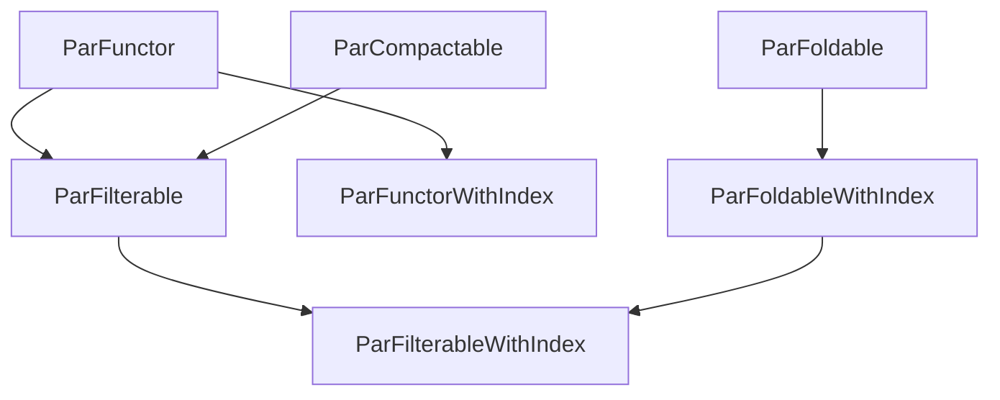
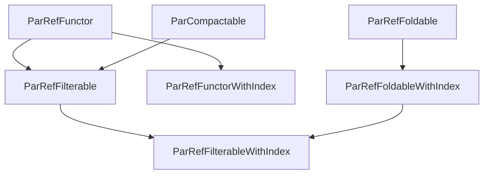

## Thread Safety and Parallelism

The library provides a parallel trait hierarchy that mirrors the sequential one.
All `par_*` free functions accept plain `impl Fn + Send + Sync` closures: no wrapper
types required. Element types require `A: Send`; closures require `Send + Sync`.



| Parallel trait           | Operations                     | Supertraits                                        |
| ------------------------ | ------------------------------ | -------------------------------------------------- |
| `ParFunctor`             | `par_map`                      | `Kind`                                             |
| `ParCompactable`         | `par_compact`, `par_separate`  | `Kind`                                             |
| `ParFilterable`          | `par_filter_map`, `par_filter` | `ParFunctor + ParCompactable`                      |
| `ParFoldable`            | `par_fold_map`                 | `Kind`                                             |
| `ParFunctorWithIndex`    | `par_map_with_index`           | `ParFunctor + FunctorWithIndex`                    |
| `ParFoldableWithIndex`   | `par_fold_map_with_index`      | `ParFoldable + FoldableWithIndex`                  |
| `ParFilterableWithIndex` | `par_filter_map_with_index`    | `ParFilterable + ParFoldableWithIndex + WithIndex` |

`ParFilterable` provides default implementations of `par_filter_map` and `par_filter`
derived from `par_map` + `par_compact`; types can override them for single-pass efficiency.

- **`SendCloneFn`**: Thread-safe cloneable function wrappers with `Send + Sync` bounds. Implemented by `ArcFnBrand`.
- **Rayon Support**: When the `rayon` feature is enabled, `par_*` functions use rayon for true parallel execution. Otherwise they fall back to sequential equivalents.

### Parallel By-Reference Traits

A parallel by-reference hierarchy mirrors the parallel one but closures receive `&A`
instead of consuming `A`. Elements require `A: Send + Sync` (for rayon's `par_iter()`
which needs `&A: Send`, equivalent to `A: Sync`).



| Par-Ref trait               | Operations                                                   | Supertraits                                 |
| --------------------------- | ------------------------------------------------------------ | ------------------------------------------- |
| `ParRefFunctor`             | `par_ref_map`                                                | `RefFunctor`                                |
| `ParRefFoldable`            | `par_ref_fold_map`                                           | `RefFoldable`                               |
| `ParRefFilterable`          | `par_ref_filter_map`, `par_ref_filter`                       | `ParRefFunctor + ParCompactable`            |
| `ParRefFunctorWithIndex`    | `par_ref_map_with_index`                                     | `ParRefFunctor + RefFunctorWithIndex`       |
| `ParRefFoldableWithIndex`   | `par_ref_fold_map_with_index`                                | `ParRefFoldable + RefFoldableWithIndex`     |
| `ParRefFilterableWithIndex` | `par_ref_filter_map_with_index`, `par_ref_filter_with_index` | `ParRefFilterable + RefFilterableWithIndex` |

Key benefit: `par_ref_filter_map(|x: &A| ...)` avoids consuming elements that get
filtered out. Only elements that survive the filter are transformed. Implemented for
`Vec` (using `par_iter()`) and `CatList` (collecting to Vec for rayon).

```
use fp_library::{
	brands::*,
	functions::*,
};

let v = vec![1, 2, 3, 4, 5];
// Map in parallel (uses rayon if feature is enabled)
let doubled: Vec<i32> = par_map::<VecBrand, _, _>(|x: i32| x * 2, v.clone());
assert_eq!(doubled, vec![2, 4, 6, 8, 10]);
// Compact options in parallel
let opts = vec![Some(1), None, Some(3), None, Some(5)];
let compacted: Vec<i32> = par_compact::<VecBrand, _>(opts);
assert_eq!(compacted, vec![1, 3, 5]);
// Fold in parallel
let result = par_fold_map::<VecBrand, _, _>(|x: i32| x.to_string(), v);
assert_eq!(result, "12345".to_string());
```
