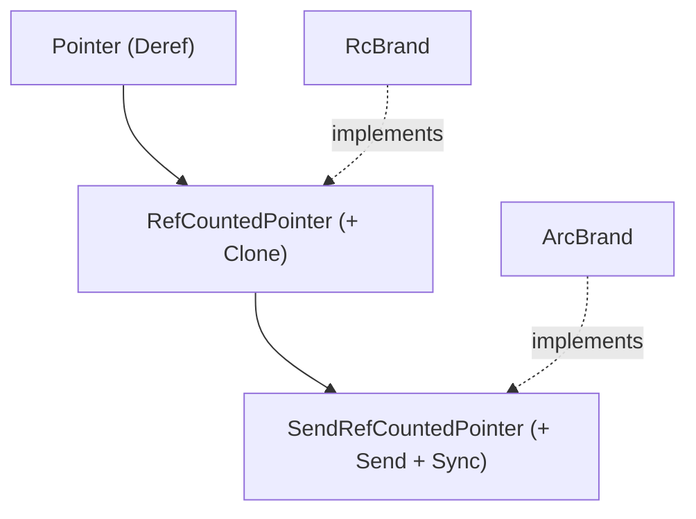

# Pointer Abstraction & Shared Semantics

The library uses a unified pointer hierarchy to abstract over reference counting strategies (`Rc` vs `Arc`) and to enable shared memoization semantics for lazy evaluation.

## Pointer Hierarchy

## Generic Function Brands

`FnBrand
` is parameterized over a `RefCountedPointer` brand `P`:

- `RcFnBrand` is a type alias for `FnBrand<RcBrand>`.
- `ArcFnBrand` is a type alias for `FnBrand<ArcBrand>`.

This allows a unified implementation of `CloneFn` while `SendCloneFn` is only implemented when `P: SendRefCountedPointer`. Both traits are parameterized by `ClosureMode` (`Val` or `Ref`), controlling whether the wrapped closure takes its input by value (`Fn(A) -> B`) or by reference (`Fn(&A) -> B`). The composable variant `Arrow` (for optics) adds `Category + Strong` supertraits. Code that is generic over the pointer brand can work with either `Rc` or `Arc` without duplication.

## Shared Memoization

`Lazy` uses a configuration trait (`LazyConfig`) to abstract over the underlying storage and synchronization primitives, ensuring shared memoization semantics across clones:

- `Lazy<'a, A, Config>` is parameterized by a `LazyConfig` which defines the storage type.
- `RcLazy` uses `Rc<LazyCell>` for single-threaded, shared memoization.
- `ArcLazy` uses `Arc<LazyLock>` for thread-safe, shared memoization.

This ensures Haskell-like semantics where forcing one reference updates the value for all clones.

## Design Rationale

- **Correctness:** Ensures `Lazy` behaves correctly as a shared thunk rather than a value that is re-evaluated per clone.
- **Performance:** Leverages standard library types (`LazyCell`, `LazyLock`) for efficient, correct-by-construction memoization.
- **Flexibility:** Separates the concern of memoization (`Lazy`) from computation (`Trampoline`/`Thunk`), allowing users to choose the right tool for the job.
