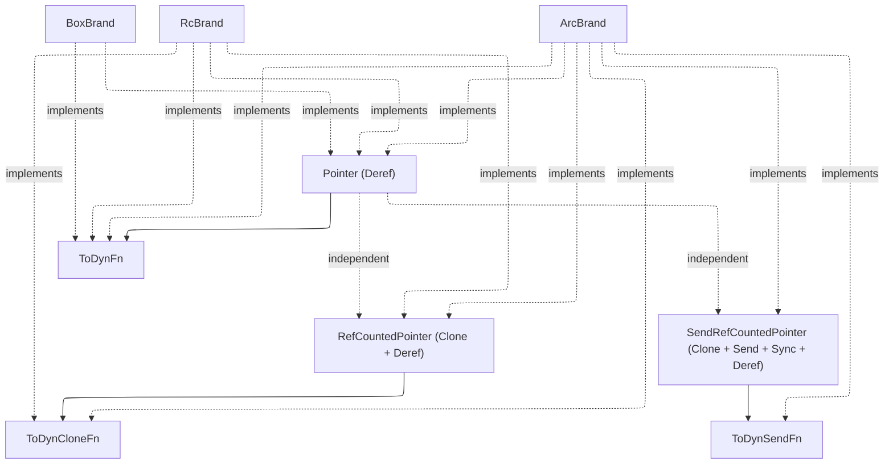

### Pointer Abstraction & Shared Semantics

The library uses a flat set of independent pointer traits to abstract over pointer strategies (`Box` vs `Rc` vs `Arc`) and to enable shared memoization semantics for lazy evaluation.

#### Pointer Traits

The pointer and coercion traits are organized as independent traits rather than a linear supertrait chain. Supertrait links exist only where a trait's methods reference the supertrait's associated type:

| Trait                   | Associated type                    | Bounds                        | Purpose                                                                 |
| :---------------------- | :--------------------------------- | :---------------------------- | :---------------------------------------------------------------------- |
| `Pointer`               | `Of`                               | `Deref`                       | Heap-allocated pointer                                                  |
| `RefCountedPointer`     | `Of`, `TakeCellOf`                 | `Clone + Deref`               | Clonable reference-counted pointer                                      |
| `SendRefCountedPointer` | `Of`                               | `Clone + Send + Sync + Deref` | Thread-safe reference-counted pointer                                   |
| `ToDynFn`               | (uses `Pointer::Of`)               |                               | Coerce `impl Fn` -> `dyn Fn` behind a pointer                           |
| `ToDynCloneFn`          | (uses `RefCountedPointer::Of`)     |                               | Coerce `impl Fn` -> `dyn Fn` behind a clonable pointer                  |
| `ToDynSendFn`           | (uses `SendRefCountedPointer::Of`) |                               | Coerce `impl Fn` -> `dyn Fn + Send + Sync` behind a thread-safe pointer |

| Brand      | Implements                                                |
| :--------- | :-------------------------------------------------------- |
| `BoxBrand` | `Pointer`, `ToDynFn`                                      |
| `RcBrand`  | `Pointer`, `RefCountedPointer`, `ToDynFn`, `ToDynCloneFn` |
| `ArcBrand` | All six traits                                            |

#### Generic Function Brands

`FnBrand
` is parameterized over a `RefCountedPointer` brand `P`:

- `RcFnBrand` is a type alias for `FnBrand<RcBrand>`.
- `ArcFnBrand` is a type alias for `FnBrand<ArcBrand>`.

This allows a unified implementation of `CloneFn` while `SendCloneFn` is only implemented when `P: ToDynSendFn`. Both traits are parameterized by `ClosureMode` (`Val` or `Ref`), controlling whether the wrapped closure takes its input by value (`Fn(A) -> B`) or by reference (`Fn(&A) -> B`). The composable variant `Arrow` (for optics) adds `Category + Strong` supertraits. Code that is generic over the pointer brand can work with either `Rc` or `Arc` without duplication.

#### Shared Memoization

`Lazy` uses a configuration trait (`LazyConfig`) to abstract over the underlying storage and synchronization primitives, ensuring shared memoization semantics across clones:

- `Lazy<'a, A, Config>` is parameterized by a `LazyConfig` which defines the storage type.
- `RcLazy` uses `Rc<LazyCell>` for single-threaded, shared memoization.
- `ArcLazy` uses `Arc<LazyLock>` for thread-safe, shared memoization.

This ensures Haskell-like semantics where forcing one reference updates the value for all clones.
See [Lazy Evaluation](./lazy-evaluation.md) for the full type overview, trade-offs, and decision guide.

#### Design Rationale

- **Correctness:** Ensures `Lazy` behaves correctly as a shared thunk rather than a value that is re-evaluated per clone.
- **Performance:** Leverages standard library types (`LazyCell`, `LazyLock`) for efficient, correct-by-construction memoization.
- **Flexibility:** Separates the concern of memoization (`Lazy`) from computation (`Trampoline`/`Thunk`), allowing users to choose the right tool for the job.
