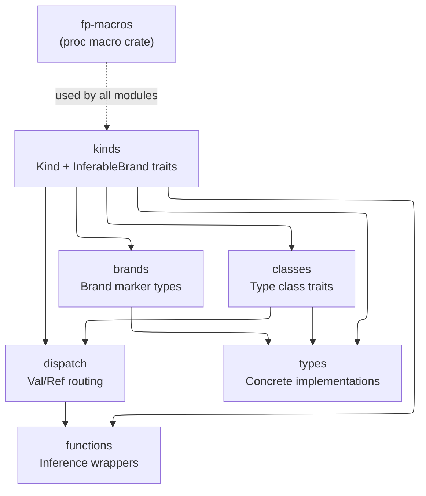

# Project Structure

## Module Dependency Graph

Solid arrows show intra-crate `use` dependencies. The dashed arrow shows
the proc macro crate boundary (fp-macros is a separate crate used at
compile time by all fp-library modules).

## Modules

- **fp-macros**: Procedural macros for HKT traits (`trait_kind!`, `impl_kind!`, `Apply!`), do-notation (`m_do!`, `a_do!`), brand inference (`InferableBrand!`), and documentation generation (`#[document_module]`, `#[document_signature]`, etc.).
- **kinds**: `Kind` and `InferableBrand` trait definitions generated by `trait_kind!`. Provides type application machinery mapping brands to concrete types and back.
- **brands**: Zero-sized brand marker types (e.g., `OptionBrand`, `VecBrand`) that represent unapplied type constructors. Leaf nodes in the dependency graph with no outgoing edges.
- **classes**: Type class trait definitions (`Functor`, `Monad`, `Foldable`, etc.) and their by-reference counterparts (`RefFunctor`, `RefSemimonad`, etc.). Each trait module also defines free function wrappers used by the `explicit` sub-module.
- **dispatch**: Val/Ref dispatch traits, inference wrapper functions, and explicit dispatch functions. Each module (e.g., `dispatch/functor.rs`) contains the dispatch trait with Val/Ref impls, the inference wrapper that combines brand inference (via `InferableBrand`) with dispatch, and a `mod explicit` submodule with the brand-explicit variant.
- **functions**: Facade module (`functions.rs`) that re-exports inference wrappers from `dispatch/` as bare names (`map`, `bind`, etc.) and explicit variants in the `explicit` sub-module. No source files in `functions/`.
- **types**: Concrete type implementations of type classes. Contains both custom types (`Identity`, `Lazy`, `CatList`, `Coyoneda`) and implementations for standard library types (`Option`, `Vec`, `Result`).
